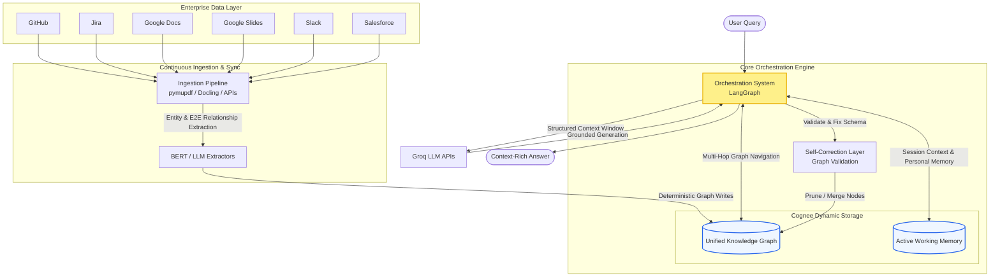
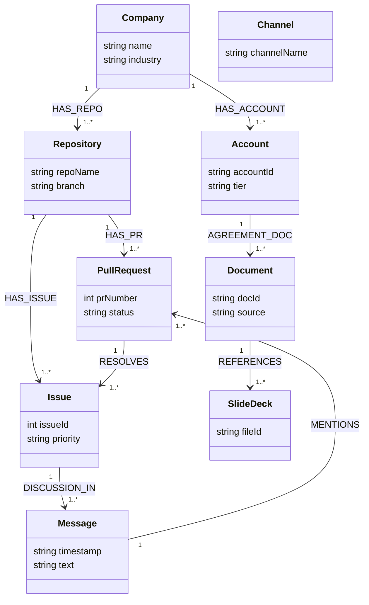
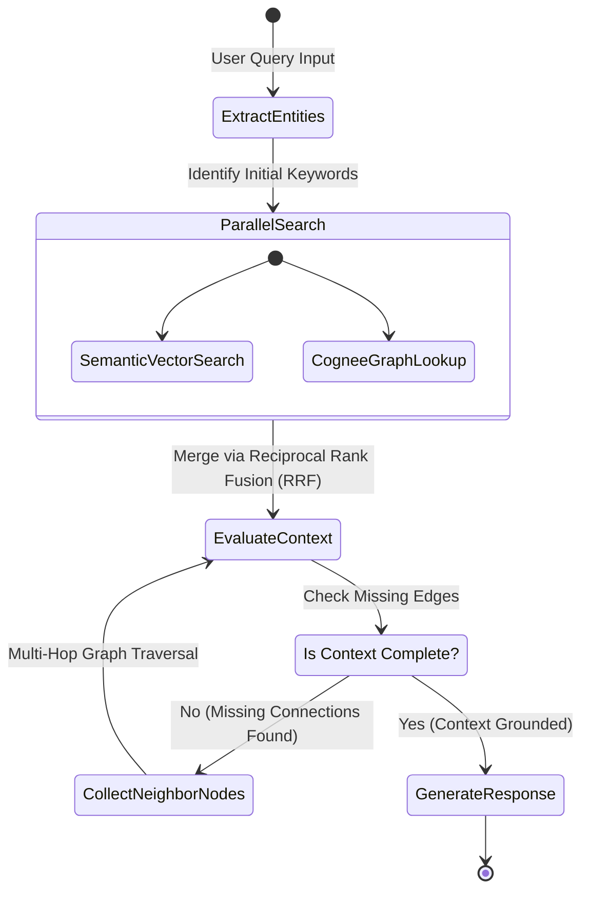
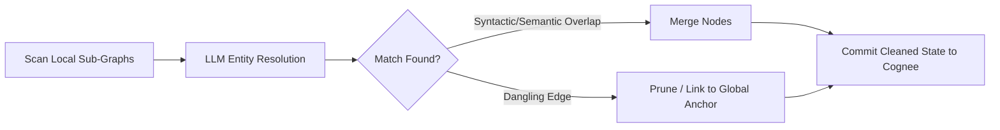

# Architecting an Enterprise Knowledge Engine: Overcoming the AI Tax with GraphRAG, Cognee, and LangGraph

The promise of Enterprise AI is simple: give an LLM access to your company’s internal tools, and let it answer complex organizational questions. But in reality, enterprise search is broken. Naive vector retrieval fails the moment a query requires connecting the dots across disparate platforms.
This post details a production-grade blueprint that solves workspace search by transforming fragmented data silos into a dynamically synced, self-correcting Knowledge Graph using **Cognee**, **LangGraph**, and **Groq**.

## User Journey:
User Journey:

1. User will sign up.
2. Authorise his Github (Will be able to select the repo), Google Docs (Will be abloe to select the files he wanted to ingest). 
3. After he selects we will start the Continous Ingesation pipeline through Backend SQS and we will convert them to KG. 
4. Updation on every 1 Hr. (Optional)
5. Chat Interface Real time with Langchain and Cognee GraphDB.

## 1. The Core Problem of Enterprise AI & Workspace Search

Traditional enterprise search suffers from what can be called the **"Context Fragment Tax."** Information within an organization is rarely localized; it is distributed across specialized platforms:

* Code state and developer discussions live in **GitHub**.
* Product requirements and agile tracking sit in **Jira**.
* Standard operating procedures and long-form text occupy **Google Docs** and **Slides**.
* Cross-functional context flashes by instantly in **Slack**.
  When an AI system relies purely on **Standard Vector RAG (Retrieval-Augmented Generation)**, it runs into three fundamental roadblocks:

```text
[Naive Vector Search] ──> Compares flat text snippets via cosine similarity
                          ❌ Fails to link conceptually isolated platforms
                          ❌ Lacks structural awareness (e.g., PR #5 relates to Ticket J-10)
                          ❌ Blind to multi-hop corporate history
```

1. **The Multi-Hop Blindspot:** If a user asks, *"What was the technical resolution for the API outage mentioned in Slack yesterday?"*, a vector database looks for chunks containing "API outage text." If the actual fix is documented inside a merged GitHub Pull Request that doesn't explicitly repeat the Slack phrasing, standard RAG cannot connect the two.
2. **Context Fragmentation & Loss of Lineage:** Chunking documents destroys structural hierarchy. A bullet point on slide 14 loses its association with the presentation's overarching project scope on slide 2.
3. **High Noise-to-Signal in Dynamic Environments:** Slack threads and Jira comments are noisy. Vector embeddings capture the surface semantics of this noise rather than the underlying factual entities and their evolving states.

## 2. Our Solution: The Enterprise Graph Engine

This architecture replaces naive vector lookups with a **hybrid deterministic and semantic graph intelligence layer**. Instead of keeping text chunks isolated, the engine extracts **entities** and **relationships** from every connected enterprise tool, constructing an unified corporate brain.

### The Project Architecture



## 3. What is Cognee?

**Cognee** is an open-source framework designed to implement **GraphRAG** and semantic memory structures for AI applications. It serves as the storage, grounding, and retrieval engine for the architecture.
Unlike standalone vector databases or rigid native graph databases, Cognee creates a **hybrid topology**. It maps text chunks into standard multi-dimensional vector spaces while simultaneously extracting and anchor-linking those chunks to an explicit, typed semantic entity graph.
Within this setup, Cognee acts as the long-term enterprise memory store and the short-term transactional interaction log.

## 4. The Unified Enterprise Graph Data Model

To reason across domains, we normalize all platform data into a tightly defined, interconnected **Graph Schema** inside Cognee. This enables cross-platform path tracing (e.g., tracing a line from a Salesforce Account to a Slack thread to a GitHub commit).



### Core Schema Definitions

* **GitHub:** (Company)-[:HAS_REPO]->(Repository)-[:HAS_PR]->(PullRequest)
* **Jira & Slack:** (Issue)-[:DISCUSSION_IN]->(Channel)-[:CONTAINED]->(Message)
* **Salesforce & Google Docs:** (Account)-[:AGREEMENT_DOC]->(Document)-[:MENTIONS]->(Issue)

## 5. Setting Up the Pipelines: Initial Ingestion & Dynamic Sync

Populating and maintaining a real-time Knowledge Graph requires balancing large scale structural text-parsing with high-frequency event synchronization.

### Initial Bulk Ingestion

1. **Extraction:** Documents (PDFs, Google Docs, Slides) are systematically read using Docling and pymupdf to maintain absolute structural layouts, tables, and document sections.
2. **Entity & Relation Extraction:** Rather than performing blind text chunking, chunks are passed through fine-tuned BERT-based feature extractors and fast LLMs. They isolate concrete enterprise entities and their explicit semantic relationships.
3. **Graph Initialization:** These extracted nodes and relationships are written into **Cognee**.

### Dynamic Sync Architecture (The 30-Minute Delta Loop)

To ensure the graph doesn't drift from corporate reality, a stateless cron system tracks platform changes without requiring computationally heavy graph rebuilds.

```text
[Target Platform API] ──(Every 30 Mins)──> [Compute Webhook/API Diff]
                                                   │
                                                   ▼
                                         [Isolate Changed Items]
                                                   │
                                                   ▼
                                      [Update/Upsert Specific Nodes]
                                                   │
                                                   ▼
                                         [Commit to Cognee KG]
```

* For **GitHub/Jira**, the engine polls API audit logs every 30 minutes to capture new commits, PR merges, or status changes.
* It runs a local **diff evaluation** against the current known state.
* It executes surgical **upsert operations** inside Cognee—modifying edge states (e.g., changing a PR status node from OPEN to MERGED) without altering historical context.

## 6. Multi-Hop Active Retrieval Pipeline using LangGraph

When a question hits the system, retrieval is executed as an agentic, iterative state machine built with **LangGraph**. Rather than relying on a single vector database search, the system actively queries the graph structure multiple times to build context.



### The Step-by-Step Retrieval Execution Loop:

1. **Query Deconstruction:** LangGraph processes the incoming query and identifies primary target entities.
2. **Parallel Hybrid Search:** The engine triggers a dense vector similarity lookup across document chunks while simultaneously running a structural entity match inside the **Cognee Graph**.
3. **Reciprocal Rank Fusion (RRF):** The results are combined mathematically, evaluating both text similarity and structural node connectivity weights to bring high-signal matches to the top.
4. **Active Multi-Hop Traversal:** If the state engine evaluates that information spans across tools, it navigates the graph edges (e.g., following Issue #4 to PR #5 to Commit Node) to pull hidden neighboring nodes into the final prompt context.
5. **Fast Inference Generation:** The contextualized knowledge bundle is passed to the **Groq LLM API** for immediate execution.

## 7. Graph Self-Correction and Maintenance

Left unchecked, distributed human inputs cause graph structures to degrade over time. Different teammates refer to the exact same entities using varying terminology across platforms:

```text
[Slack Message]: "Let's update the payment flow."  ──> Entity: payment flow
[Jira Ticket]:  "Refactor StripGateways module."  ──> Entity: StripGateways
```

Without automated graph maintenance, these items remain isolated, breaking multi-hop search capabilities.

### The Self-Correction Engine Workflow

The system runs an ongoing background asynchronous evaluation loop using LangGraph to guarantee data integrity:



* **Entity Resolution & De-duplication:** The background task evaluates newly created neighbor nodes for semantic overlap. If it determines that payment flow and StripGateways represent identical code components, it safely merges them into a single global entity node while retaining both source edge attributions.
* **Orphan and Dangling Edge Pruning:** If a Slack message or Jira ticket referencing a temporary task is deleted, the system clears the corresponding node while archiving the historical connection paths, keeping storage performance optimized.

## 8. Cognee as Conversational Memory: Storing Person-Specific Information

Beyond serving as a static enterprise knowledge base, **Cognee** is actively utilized as a dynamic memory layer during customer and internal user chats.
When a user interacts with the system, they frequently provide implicit and explicit context about their role, preferences, or ongoing tasks (e.g., *"I am a frontend developer,"* or *"Only show me Python examples."*). If the system cannot remember this context, the user experience degrades rapidly.
**How the Memory Pipeline Works:**

1. **Real-Time Extraction:** As the user chats, the LangGraph orchestration layer uses a parallel extraction node to identify Person-Specific Information (PSI).
2. **Graph Linking in Cognee:** These details are written directly into Cognee's Memory module, creating or updating a dedicated user node. The system establishes edges like (User)-[:PREFERS]->(Language {name: "Python"}) or (User)-[:WORKS_ON]->(Repository {name: "frontend-app"}).
3. **Contextual Retrieval:** In future turns, when the user asks, *"What are the open bugs in my current project?"*, LangGraph first queries Cognee's memory. It resolves *"my current project"* by traversing the WORKS_ON edge, instantly grounding the subsequent vector and graph searches to the correct repository.
   This mechanism ensures the assistant doesn't just know the company's data—it deeply understands the specific user querying it, enabling hyper-personalized and context-aware responses.

# hyperspace
# hyperspace
