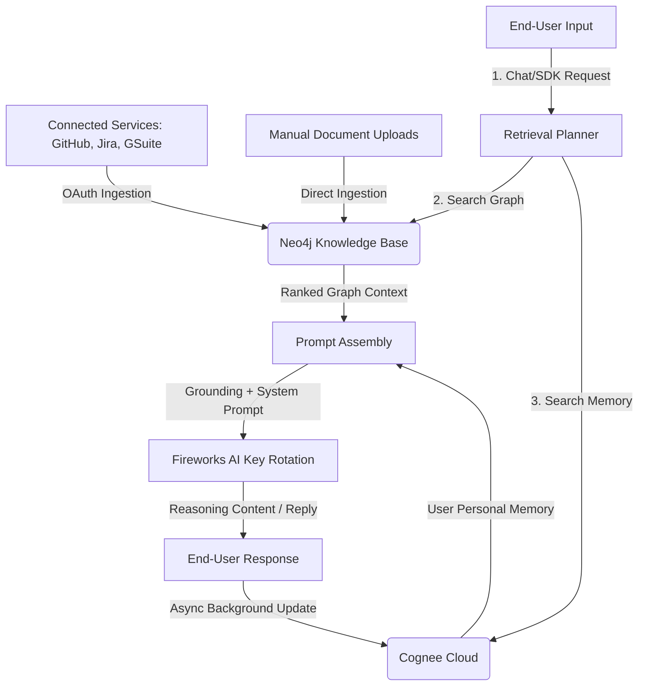

# Welcome to hypr

**hypr** is an enterprise-grade AI knowledge platform designed to bridge the gap between static corporate knowledge repositories and dynamic, personalized user conversations. 

It is built from the ground up to solve two distinct challenges in AI-driven enterprise applications:
1. **Shared Knowledge Retrieval**: Making unstructured documents, codebase files, and workspace activities (GitHub, Jira, Google Workspace) searchable by a team or application context.
2. **Individual Memory Personalization**: Storing, updating, and recalling personal preferences, constraints, and facts about an end-user over the course of multiple separate sessions.

---

## The Dual-Engine Architecture

Instead of overloading a single database with both team knowledge and individual user profiles, `hypr` divides responsibilities across two highly optimized engines:

| Engine / Component | Backing Store | Purpose & Scope |
| :--- | :--- | :--- |
| **Knowledge Base** | **Neo4j Graph Database** | GraphRAG system that ingests files, PRs, issues, calendar events, and code into semantic nodes (`:Entity`, `:Chunk`, `:Document`, etc.). Shared across the workspace. |
| **Personal Memory** | **Cognee Cloud** (via HTTP API) | An agentic personalization memory that automatically extracts key facts about a user's role, preferences, or tasks from active conversation turns. Stored in isolated tenant datasets per user. |
| **hypr-sdk Client** | *Stateless Client* | A lightweight TypeScript library (`packages/hypr-sdk`) allowing external applications to query a `hypr` app, fetch graph-grounded context, and obtain memory-personalized answers instantly. |

::: tip Core Separation Principle
A node in your Neo4j Knowledge Base never bleeds into Cognee Memory, and Cognee Memory query results are strictly private. This guarantees both **query performance** and **data privacy/compliance** (e.g., preventing one user's private settings from leaking to another via shared retrieval).
:::

---

## High-Level System Data Flow

---

## The Three Chat Surfaces

`hypr` exposes three distinct interfaces tailored for developers, workspace owners, and end-users:

1. **Owner-Facing Chat (`/api/chat`)**
   - **User**: The admin or workspace owner.
   - **Context**: Accesses all documents and graph data across the entire account.
   - **Memory**: Scoped to the workspace owner.
2. **Application Playground (`/api/app-chat`)**
   - **User**: The admin testing app-specific configurations.
   - **Context**: Grounded specifically in the subset of Knowledge Bases linked to the current Application.
   - **Memory**: Supports custom playground end-user simulators.
3. **Public SDK Gateway (`/api/sdk/query`)**
   - **User**: Real-world end-users interacting with a third-party application integrated with the `hypr-sdk`.
   - **Context**: Strictly scoped to the linked Knowledge Bases of the validated App.
   - **Memory**: Automatically queries and writes to the private, isolated Cognee dataset corresponding to the active `userId`.

---

## Where to Go Next

* **Architecture Deep Dive**: Learn about model key rotation, local embeddings, and index schemas in [Architecture](/guide/architecture).
* **Graph Structure**: Explore the Neo4j schema design and hybrid retrieval in [Knowledge Base (Neo4j)](/guide/knowledge-base).
* **Memory & Personalization**: Read about isolated user datasets and prompt injection fixes in [Memory (Cognee)](/guide/memory).
* **Integrate the SDK**: Ready to connect your product? Follow the [hypr-sdk Getting Started](/sdk/getting-started) guide.
